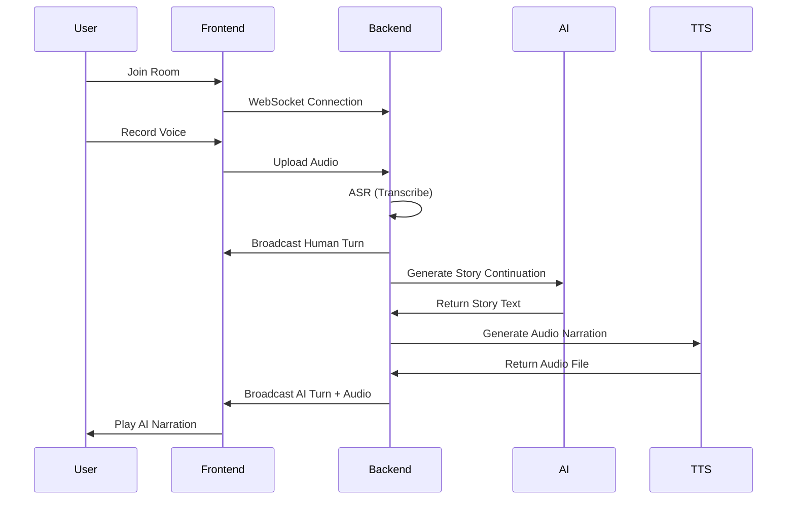

# 📖 Lorebound

<div align="center">


**A Voice-Driven, Multiplayer AI Storytelling Platform**


*Speak. Create. Become the story.*

[](https://www.python.org/)
[](https://fastapi.tiangolo.com/)
[](https://nextjs.org/)
[](LICENSE)
[](http://makeapullrequest.com)

[Demo](https://drive.google.com/file/d/1OtgdhSgnxYFOpR1BIqdr6QYeotY4zAwF/view?usp=sharing) · [Documentation](#) · [Report Bug](#) · [Request Feature](#)

</div>

---

## 🌟 Overview

Lorebound is a **real-time, voice-based collaborative storytelling platform** where multiple users take turns speaking, and an AI dynamically continues the narrative. Stories are narrated aloud, persist across sessions, and can be replayed or exported like a podcast.

This project blends **speech recognition**, **AI storytelling**, **offline neural text-to-speech**, and **real-time multiplayer systems** into one immersive experience.

### ✨ Key Features

| Feature | Description |
|---------|-------------|
| 🎙 **Voice-First Interaction** | Users contribute to the story using spoken input instead of typing |
| 👥 **Multiplayer Rooms** | Multiple participants join a shared room and collaboratively build a story |
| 🤖 **AI Story Continuation** | After human turns, an AI continues the narrative based on recent context |
| 🔊 **AI Voice Narration** | AI responses are narrated using an offline neural TTS engine (no API limits) |
| ⚡ **Real-Time Updates** | WebSocket-based live events for joins, turns, and AI narration |
| 📖 **Persistent Stories** | Completed stories are saved and can be replayed anytime |
| 🎧 **Podcast-Style Replay & Export** | Stories can be replayed turn-by-turn or exported as audio/text |
| 🌌 **Immersive Onboarding** | Animated landing experience with a floating storybook intro |

---

## 🏗️ System Architecture

```
┌─────────────────────────────────────────────────────────────┐
│          Frontend (Next.js + Framer Motion)                 │
│                                                               │
│  ┌──────────────────┐  ┌──────────────────┐                │
│  │ Animated Landing │  │   Join Room UI   │                │
│  │   Page (Book)    │  │                  │                │
│  └──────────────────┘  └──────────────────┘                │
│                                                               │
│  ┌──────────────────────────────────────────┐               │
│  │     Real-time Story View (WebSocket)      │               │
│  └──────────────────────────────────────────┘               │
└─────────────────────────────────────────────────────────────┘
                            ▼
┌─────────────────────────────────────────────────────────────┐
│               Backend (FastAPI)                              │
│                                                               │
│  ┌────────────────┐  ┌────────────────┐  ┌────────────────┐│
│  │  WebSockets    │  │ Audio Upload   │  │  ASR (Whisper) ││
│  │  (Live Events) │  │      API       │  │                ││
│  └────────────────┘  └────────────────┘  └────────────────┘│
│                                                               │
│  ┌────────────────┐  ┌────────────────┐  ┌────────────────┐│
│  │ AI Story Gen   │  │ Offline Neural │  │  Room & Turn   ││
│  │     (LLM)      │  │  TTS (Coqui)   │  │  Management    ││
│  └────────────────┘  └────────────────┘  └────────────────┘│
│                                                               │
│  ┌────────────────────────────────────────┐                 │
│  │   Story Persistence (JSON-based)       │                 │
│  └────────────────────────────────────────┘                 │
└─────────────────────────────────────────────────────────────┘
```

---

## 🛠 Tech Stack

### Frontend
- **[Next.js](https://nextjs.org/)** - React framework
- **[Framer Motion](https://www.framer.com/motion/)** - Animations
- **Web Audio API** - Audio recording & playback

### Backend
- **[FastAPI](https://fastapi.tiangolo.com/)** - High-performance Python web framework
- **WebSockets** - Real-time bidirectional communication
- **[Whisper](https://github.com/openai/whisper)** - Automatic Speech Recognition
- **Offline Neural TTS** - Mozilla TTS / Coqui TTS
- **Background tasks** - Async processing for low-latency UX

### AI / ML
- **Speech-to-Text** (Whisper ASR)
- **Prompt-engineered AI storytelling** (LLM)
- **Neural Text-to-Speech** (offline, no API dependency)

---

## 🚀 How It Works



### Step-by-Step Flow

1. 🚪 User joins a room
2. 🎤 User records voice input
3. 📝 Backend transcribes audio (ASR)
4. 📢 Human turn is saved & broadcast
5. 🤖 AI generates next story segment
6. 🔊 AI narration is generated (TTS)
7. 📻 AI turn is broadcast and played aloud
8. 🔄 Story continues collaboratively

---

## 📦 Installation

### Prerequisites

- **Python 3.11+**
- **Node.js 18+**
- **npm** or **yarn**

### Backend Setup

```bash
# Clone the repository
git clone https://github.com/yourusername/lorebound.git
cd lorebound/backend

# Create virtual environment
python3.11 -m venv venv
source venv/bin/activate  # On Windows: venv\Scripts\activate

# Install dependencies
pip install -r requirements.txt

# Run the server
uvicorn app.main:app --reload
```

The backend will start at `http://localhost:8000`

### Frontend Setup

```bash
# Navigate to frontend directory
cd ../frontend

# Install dependencies
npm install
# or
yarn install

# Run development server
npm run dev
# or
yarn dev
```

The frontend will start at `http://localhost:3000`

---

## 📂 Project Structure

```
lorebound/
├── backend/
│   ├── app/
│   │   ├── main.py           # FastAPI app entry point
│   │   ├── audio.py          # Audio upload & ASR processing
│   │   ├── tts.py            # Offline Text-to-Speech
│   │   ├── llm.py            # AI story generation
│   │   ├── rooms.py          # Room & state management
│   │   ├── websocket.py      # Real-time WebSocket handlers
│   │   └── persistence.py    # Story saving & loading
│   ├── stories/              # Saved story files
│   └── requirements.txt      # Python dependencies
│
├── frontend/
│   ├── pages/
│   │   ├── index.tsx         # Animated landing page
│   │   ├── join.tsx          # Join room interface
│   │   └── room/
│   │       └── [id].tsx      # Story room (main interface)
│   ├── components/
│   │   ├── FloatingBook.tsx  # Hero animation
│   │   ├── AudioRecorder.tsx # Voice input component
│   │   └── StoryTimeline.tsx # Story display
│   ├── styles/               # CSS modules
│   └── package.json          # Node dependencies
│
└── README.md
```

---

## 🎮 Usage

### Creating a Story Room

1. Navigate to `http://localhost:3000`
2. Click "Create New Story"
3. Choose a genre or theme
4. Share the room code with friends

### Joining a Room

1. Click "Join Existing Room"
2. Enter the room code
3. Wait for your turn to speak

### Recording Your Part

1. Click the microphone button
2. Speak your story contribution
3. Click stop when finished
4. Listen to the AI continue the story

### Replaying Stories

1. Navigate to "My Stories"
2. Select a completed story
3. Click play to hear the full narration

---

## 🎯 Why Lorebound Is Different

| Traditional Approach | Lorebound |
|---------------------|-----------|
| 📝 Text-first | 🎙 Voice-native |
| 👤 Single-player | 👥 Multiplayer |
| 💰 Paid TTS APIs | 🔒 Offline-safe, free |
| 🐌 Request-blocking | ⚡ Event-driven |
| 🧪 Demo/prototype | 🎨 Production-ready design |

---

## 🧩 Future Enhancements

- [ ] 🎭 **Character Personas** - Distinct AI voices for different characters
- [ ] 🌳 **Branching Story Timelines** - Multiple paths and outcomes
- [ ] ☁️ **Cloud Persistence** - Postgres / Supabase integration
- [ ] 🎙 **Multi-Voice AI Narration** - Different narrators for segments
- [ ] 📱 **Mobile-First UI** - Optimized mobile experience
- [ ] 🔐 **Auth & Private Rooms** - User authentication system
- [ ] 🌍 **Multi-language Support** - International storytelling
- [ ] 📊 **Story Analytics** - Engagement metrics and insights
- [ ] 🎨 **Custom Themes** - Personalized room aesthetics
- [ ] 💾 **Export to Podcast Platforms** - Direct publishing

---

## 🤝 Contributing

Contributions are welcome! Please feel free to submit a Pull Request.

1. Fork the project
2. Create your feature branch (`git checkout -b feature/AmazingFeature`)
3. Commit your changes (`git commit -m 'Add some AmazingFeature'`)
4. Push to the branch (`git push origin feature/AmazingFeature`)
5. Open a Pull Request

---

## 📄 License

This project is licensed under the MIT License - see the [LICENSE](LICENSE) file for details.

---

## 👩‍💻 Author

**Umangi Nigam**

- B.Tech CSE | AI & Full-Stack Developer
- Focus: Real-time systems, AI orchestration, applied ML
- GitHub: [@Umangi](https://github.com/Umanginigam)

---

## 🙏 Acknowledgments

- OpenAI Whisper for speech recognition
- Coqui TTS for offline neural voice synthesis
- FastAPI for the amazing backend framework
- Next.js and Vercel for frontend tooling
- The open-source community

---

<div align="center">

**⭐ If you like this project, please give it a star! ⭐**

Made with ❤️ and lots of ☕

</div>
